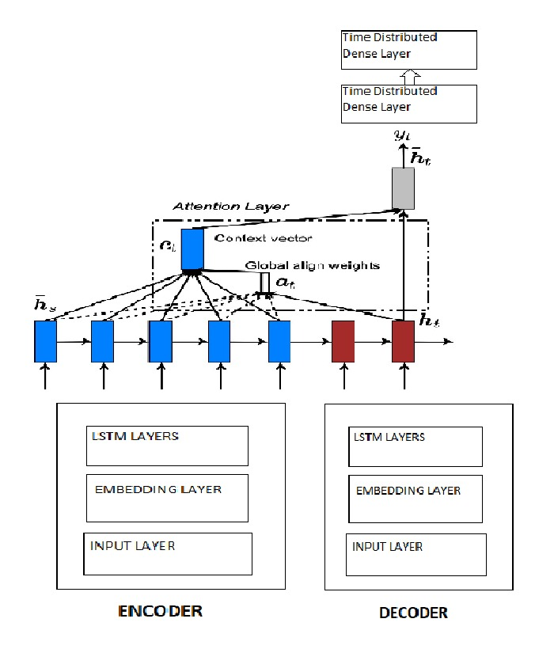
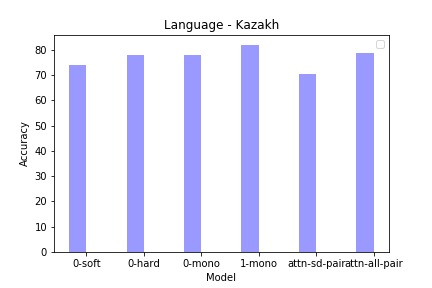
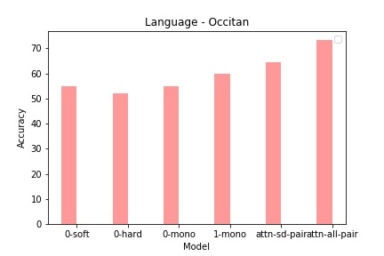

# Crosslingual-Transfer-Inflection-Generation

## Introduction to the problem statement

Inflection is the change in the form of a word to express different grammatical categories like tense, gender, voice, etc. 
Natural language processing systems must be able to generate these inflected forms to perform other tasks like translation,
speech recognition, etc. effectively. Not all world’s languages are distributed equally. Some languages simply have more
resources compared to other languages. So, in this project we explored how we can transfer knowledge from high-resource languages to genetically related low-resource languages.

So, given a lemma and a bundle of morphological features, we have to generate a target inflected form. The dataset used contains many high-resource language examples and fewer low-resource language examples. In this project, the task is to perform morphological inflection in the low-resource language by exploiting some similarity to the high-resource language.

## Architecture of our model:

We created a Encoder-Decoder style model with **Luong's attention** for solving this sequence to sequence learning problem. Both Encoder and Decoder have three components: Input layer, embedding layer and Stacked LSTM layer. **We created and trained a language model whose weights are used to initialize the weights of the LSTM layers.**

We have used global attention to provide richer source encoding by taking all the time step in the source into consideration. We initially created a alignment vector which determines the similarity score between the encoder and the decoder by comparing current target hidden state with the every hidden state in source. We computed the context vector by performing the weighted average of alignment vector and the encoder states. The context vector and decoder states are concatenated and transferred using the tanh function to get the final decoding vector. This is passed through a softmax to predict the normalized value i.e., probability of the next word in the target sequence.

One other change that improved the performance was **training on multiple high-resource languages datasets for a given low-resource language**. 

All the models were implemented using Keras framework.





## Running in sd mode

```bash
#Tested on Ubuntu 19.04. Should work on all linux machines
# Create env
conda env create -f environment.yml
source activate cltmi
# Train using only adyghe-kabardian dataset (If you are using any data other than the sample data provided. Please download the data and place it in 'data' directory. Download site: https://github.com/sigmorphon/2019/tree/master/task1)
./run_model.sh sd kabardian adyghe
```

## Running in all mode

In this mode we train on multiple high-resource languages for a given low-resource target language
```bash
#Tested on Ubuntu 19.04. Should work on all linux machines
# Create env
conda env create -f environment.yml
source activate cltmi
# Train using all kabardian language dataset (If you are using any data other than the sample data provided. Please download the data and place it in 'total_data' directory. Download site: https://github.com/sigmorphon/2019/tree/master/task1)
./run_model.sh all kabardian
```

## Performance of the model

Changing the initial weights of the LSTM layers from random initialization to the weights produced by the language model improved the model performance and the validation accuracy increased.

Also, for a given target language  using the multiple source language datasets in the training process and using the global attention further improved the accuracy.

From the results below, we can see our model was performing better than or on-par with the baseline models for the two target languages Kazakh and Occitan. Similar results were achieved with other target languages also.

    

The time taken for running ~30 epochs was also considerably lower than the baseline models.

## References

1. https://sigmorphon.github.io/sharedtasks/2019/
2. Minh-Thang Luong Hieu Pham Christopher D. Manning: Effective Approaches to Attention-based Neural Machine Translation  
3. Dzmitry Bahdanau, Kyunghyun Cho, and Yoshua Bengio. 2015. Neural machine translation by jointly learning to align and translate
4. Ryan Cotterell, Georg HeigoldK. 2017. Cross-lingual, Character-Level Neural Morphological Tagging
